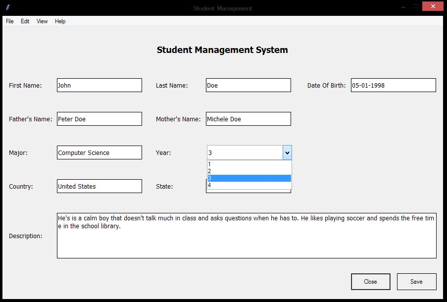

# Student Management Tkinter :100:

## Description

This is a simple student management application that showcase how you can record student data using a :snake:
Python Tkinter Library. The application records student data like __first name, last name, date of birth,
father's name, mother's name, major, year, country, state and description__.

## Running by Python

If you have python installed already, you can clone this repository to your computer and run the file `cli.py`
in the project directory by opening the terminal or command prompt and run `python cli.py`. This displays a
_student management application window_. __Make sure that you have all dependencies installed as listed below__.

## Downloading full application

To make life easier you can download the full application that doesn't need any dependency created using `pyinstaller`
by clicking [here](https://github.com/sam0132nodier/student-management-tkinter/raw/master/dist/StudentManagement.exe)
or cloning this repository and navigate to _dist folder_ in project directory.

## How to use

When you open the application the window similar to the one you see below will appear on your screen with different
inputs and labels next to them. There are some dummy data already added to the application.

- On the menu of the application you find Menu items
	- File which you can use to __Open__ JSON file having students' data and __Exit__ the application
	- Edit that you can use to __Clear__ all data in inputs
	- View that you can use to __View Students__ Data stored in the database
	- Help that you use to view this __Help__ about how to use the application and __About Application__
- You can enter data about students in all input and leave none black
- Press __Save__ button to save the data and input another student
- Press __Close__ button to close the window

	NOTE: When the data is wrong you might receive the dialog box with helpful information or data don't save at all.

## App dependencies

- tkinter \[*, ttk, filedialog, messagebox\] (Can be installed by `pip install tkinter`)
- sqlite3 (Can be installed by `pip install sqlite3`)
- uuid (Can be installed by `pip install uuid`)
- localtime, strftime from time (Came with `python3.8`)
- BytesIO from io (Came with `python3.8`)
- datetime \[datetime\] (Came with `python3.8`)
- json (Came with `python3.8`)
- re (Came with `python3.8`)
- os (Came with `python3.8`)
- sys (Came with `python3.8`)
- webbrowser (Came with `python3.8`)

## App Specifications

- Create a tkinter window
- Add menu items
- Create a data_entry_frame for labels and inputs
- Create handler functions
- Add data into the database
- Catch errors
- Add ability to open JSON files
- Add ability to view students lists
- Create an executable using PyInstaller
- Link the executable in the project README.md